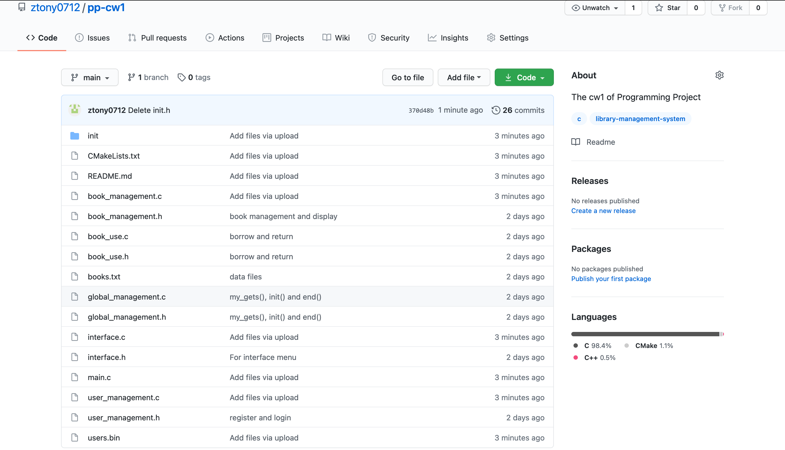

# Library Management System

## V1.0.0 

Welcome to library management system. This is the cw1 of Programming Project, which could implement some basic functions of library management. You can use it to view bookshelf, search for books, borrow and return books, add and remove books. To run it, check the following instruction and have fun!

### Environment Dependencies

* gcc v8.3.1+
* cmake v3.11.4+

### Deployment steps

Attention❗️You can use files in 'init' to reset data❗️

#### Linux

> ##### Please ensure that you have installed required version of gcc and cmake.
>
> 1. Execute the following code in order: mkdir build, cd build, cmake .., make
> 2. Move users.bin and books.txt into 'build' folder
> 3. ./library to run the procedure.

#### MacOS

> ###### Please ensure that you have installed Xcode
>
> 1. Create a new 
> C project
> 2. Replace the main.c by all of the files in cw1
> 3. Set the working directory to cw1
> 4. Click 'run'

### Directory Construction Description

* README.md  
* CMakeLists.txt  
* main.c 
* logic  
> book_management.c  
> book_management.h  
> user_management.c  
> user_management.h  
> book_use.c  
> book_use.h  

* interface  
> interface.c  
> interface.h  
> global_management.c  
> global_management.h  

* data  
> books.txt  
> users.bin 

* init  
> init.txt  
> init.bin   

### Github link

* Find my project in my github: https://github.com/ztony0712/pp-cw1
* Screenshot

